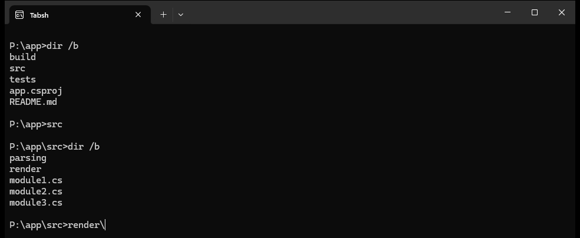
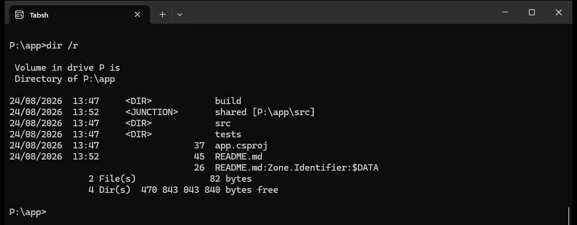
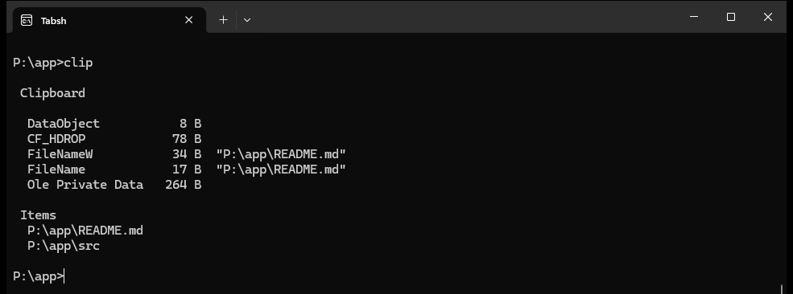
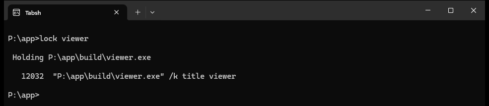
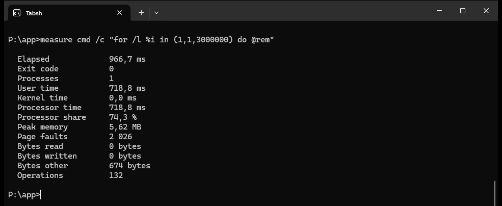
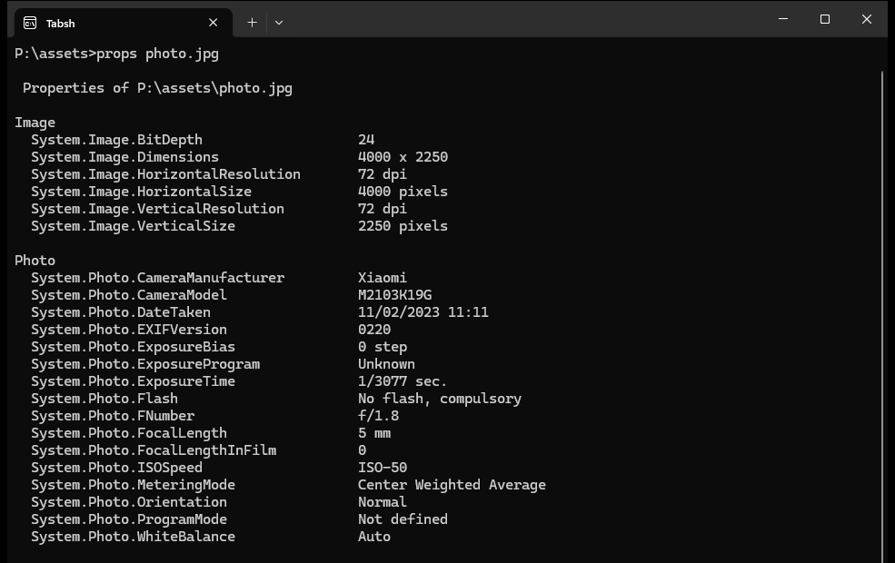

# Tabsh


A Windows command shell where TAB navigates the file system instead of merely listing it.



Typing `src` went into `src`, no `cd` involved. Then `re` and one TAB completed to `render\`, ready for the next TAB
to look inside it. That is the whole idea (this is how it used to work in TCC for those who remember!).

It runs any console program on the machine, understands the parts of cmd's grammar that are worth understanding,
and puts the effort that is left into the prompt itself.

It runs under Windows Terminal exactly like any other shell, and in a plain console window just the same.

Windows 7 or later, x86, x64 and ARM64. .NET 10, NativeAOT, a single executable of about 7 MB (2.3MB with UPX) with nothing to install.

## What you get that you did not have

Two things about moving around:

* TAB walks the file system rather than listing it, and Enter on a directory goes there.
* A line that is nothing but the name of a directory changes to it.

Then a handful of questions Windows knows the answer to and has never had a command for:

* `lock` says which process is holding a file, found by name, even one you only know as `photobase`.
* `clip` shows what is really on the clipboard, and reads it back, which `clip.exe` cannot do at all.
* `props` prints everything the shell knows about a file, the Details tab and a good deal more.
* `measure` runs a command and reports what it cost, everything it started included.
* `dir` also lists the shell namespace, so `dir "This PC"` works and drives are things you can browse.
* `base64`, `hash` and `guid`, without reaching for a script.

And underneath all of it, **every command runs inside a Windows job object**, so a command is a whole process tree
rather than one process. That is what makes Ctrl+C and `measure` mean anything.

All of it is one executable, with nothing to install, no module to import and no execution policy to set.

## The point of it

cmd's TAB completes a name and stops there. It never takes you anywhere, so getting three directories deep means
typing three separators and pressing TAB six times, and at no point has the shell actually moved.

Here TAB cycles through the names that match, and Enter on a directory goes into it.

* TAB cycles forward through the matches, Shift+TAB cycles back.
* **What is in front of you comes first.** The directory the prompt is showing is offered before anything else, and on
  an empty line TAB answers with exactly the listing `dir` would have given. Directories lead, then files.
* Directories are completed with their trailing separator, so the next TAB looks inside rather than beside.
* ESC puts back exactly what you had typed before the first TAB.
* Anything else you type ends the cycling and keeps the candidate that was showing.
* `cd`, `chdir`, `pushd`, `rd` and `rmdir` are offered directories only, because that is all they can take.
* After a `|` or a `&` the first word is a command again, so builtins, aliases and programs on PATH are offered there,
  in that order and after the local files. A word after `>` or `<` is a file name and is never treated as a command.
* Hidden and system entries are left out while nothing has been typed, the same as `dir` leaves them out, and are
  offered as soon as a name is started. So a bare TAB does not begin with `.git`, and `.g` still reaches it.
* A name containing a space comes back quoted.

Then the second half of it: **a line that is nothing but the name of an existing directory changes to that directory.**
No `cd` needed. `..` on its own goes up, `e:` goes back to where you last were on E.

The rule is narrow. It applies only when the whole line is a single word with no redirections, and only when that
word cannot mean anything else. A builtin wins, and so does a program of the same name, so a directory called `dir`
sitting in the current one cannot take over the command that lists it.

### Names that run into their argument

`cd\`, `cd..`, `cd..\..`, `md.\new`, `rd.\old`, `echo.` and `dir/b` all work **without the space**.
A builtin name followed immediately by `\`, `/` or `.` is split there, and the rest is its first argument.
TAB understands the same thing, so `cd..\Ta` and TAB completes inside the parent directory.

The split is tried last, after the word has failed to resolve as a program, rather than at parse time the way cmd does
it. So a real `md.bat` sitting in the current directory still runs, instead of being taken apart into `md` and `.bat`.

### Going up more than one level

A run of three or more dots is TCC's shorthand. `...` is two levels up, `....` is three, and every further dot is one
more.

It is a path element like any other, not a special case of `cd`, so all of these mean what you would expect:

```
...                       two levels up, on its own, as an auto cd
cd...                     the same, with the name run into it
cd ...\Tabsh\Parsing      two levels up and back down again
dir ...\notes.txt         any command that takes a path
type ....\readme.md
```

Windows normalisation strips the trailing dots off a path segment, so a `...` handed straight to the operating
system arrives as `..` and goes up one level instead of two. A dot run is therefore turned into real `..` segments
before any path is passed on, in `ShellPath`. A name that merely contains dots, `a..b`, is not a dot run and is left
alone.

## The shell namespace

Control Panel, This PC and the Recycle Bin are folders to Explorer and nothing at all to the file system. The shell
goes there too.

`@` is its drive letter. The root is `@:\`, and everything under it reads as a path, so the prompt can be copied
straight back into a `cd`:

```
cd @                      the root of the namespace, the Desktop
cd @Downloads             a child of it, in one go
cd@Downloads              the same, no space needed
cd @:\Downloads           the same again, written as the prompt writes it
cd "This PC"              a child of where you are
"This PC"                 or just its name, the same as a directory
cd ..                     back up
cd\                       the root of the drive you are on, which here is @:
cd \Downloads             and a path from that root
cd ::{20D04FE0-...}       an absolute name in a namespace, 20D04FE0-3AEA-1069-A2D8-08002B30309D is "This PC"
cd E:\Aelyo               a fully qualified path means the file system, and leaves
```

TAB completes the children of wherever you are and the names under `@`, so nothing has to be typed in full, and `dir`
lists them. `pwd` answers with the same path the prompt shows. Both use the names Explorer uses.

The file system is always tried first. Only when it has no answer is the shell folder asked for a child of that
name, so standing in your Desktop directory `cd "This PC"` works because the directory has no such child and the
shell folder does.

Two ideas of where you are exist while this is going on. The namespace one is
what you navigate, what the prompt shows and what `pwd` answers. Underneath, the process is moved to the real
directory wherever the place you are standing has one, so a program started at `@:\Downloads` runs in
`C:\Users\...\Downloads` and redirection lands on a real disk. Where there is no such directory, This PC and the
Recycle Bin and the rest, the process stays on the last real one it had.

The namespace root is never traded for the Desktop directory it shares a path with. They have different children:
This PC and the Recycle Bin hang off the root and off no directory anywhere.

## Running programs

Anything on the machine, resolved the way cmd resolves it: the current directory first, then each entry of PATH, trying
the name as typed and then with each extension in PATHEXT.

An unredirected command inherits the console outright. Nothing is pumped through this process, so full screen
programs, colours, window resizing and Ctrl+C all behave exactly as they do under cmd.

**Every command is started inside a Windows job object of its own**, and everything it goes on to start joins that
job. The child is created suspended and assigned before it runs a single instruction, because creating it running and
assigning it afterwards is a race the child can win, and anything it starts in that window escapes.

The job is what lets the shell treat a command as a whole rather than as one process. It is how Ctrl+C ends a tree
instead of orphaning half of it, and how `measure` accounts for processes that started and finished inside the
command. It is created without `JOB_OBJECT_LIMIT_KILL_ON_JOB_CLOSE`, so a command is still free to leave a server
running behind it, as cmd has always allowed.

Anything you can run under cmd runs here and behaves the same. Past that point:

* `.bat` and `.cmd` go to `cmd.exe`, always, because that is whose language they are written in. COMSPEC is honoured
  only when it names a cmd.exe, since a shell started from another shell inherits that other shell there.
* `.ps1` goes to `pwsh.exe` where there is one and to `powershell.exe` where there is not, each looked for on PATH
  and then in App Paths, so a PowerShell 7 installed without being put on PATH is still the one that runs.
* A file that exists but is not a program is opened through the association database, so `readme.md` at the prompt
  opens readme.md instead of `'readme.md' is not recognized`.
* A name that is not a file at all is looked for in App Paths, which is how `chrome` and `code` are typeable without
  being on PATH.

### dir

Reparse points are named for what they are, `<JUNCTION>`, `<SYMLINK>` or `<SYMLINKD>`, with where they point, and
`dir /r` lists the alternate data streams underneath each entry. Both of those match cmd.



Streams are not followed into a reparse point, because that would be reading somewhere else entirely.

`dir` also reads a name the way `cd` does, so `dir "This PC"` lists it from the root without going there, and
`dir @Downloads` reaches it from anywhere. A name the namespace cannot resolve, a wildcard among them, still goes to
the file system.

In the shell namespace `dir` marks a folder `<DIR>` and everything else `<ITEM>`. The distinction is the
namespace's own. The desktop holds two things called Control Panel, one that can be entered and one that only opens,
and only the first reports itself as a folder.


### clip

A copy is almost never just text. Copying two files in Explorer puts the shell's own item list on the clipboard, the
drop effect it would like, the picture it drew under the cursor and half a dozen other things, and nothing on Windows
will show you any of it. `clip` on its own lists every format, decodes the ones worth decoding, and then asks the
shell what the whole thing names.



A drag or a cut carries more still, `Preferred DropEffect` to tell a cut from a copy, and the undocumented
`DragContext` and `DragImageBits` the shell writes while it is dragging.

The items are asked of the shell rather than read out of any one format, so a `Shell IDList Array` answers and so does
a plain file drop, and a thing with no path at all still gets named. Nothing here walks an item id list by hand.
`DragContext` and `DragImageBits` are undocumented, and `Preferred DropEffect` is how a cut is told apart from a copy.

The other directions: `clip <text>` and `... | clip` set it, `clip /v` writes the text back out for a pipe, `clip /f`
writes the item paths one per line, and `clip /c` clears it.

`clip /m` watches instead of dumping once, repainting from the top of the screen every second until Ctrl+C, and
`clip /m:5` slows it down. `lock /m` does the same for a file, which is how you watch a handle come and go. Both need
a real console, since neither has anything to paint on when the output is a pipe.

### lock

"The action can't be completed because the file is open in another program" does not say which program. Restart
Manager knows, and needs no privilege to be asked.



A directory can be named too, and the answer then covers what is under it.

The name does not have to be a path. A shell extension is known by its name rather than by where it was installed,
so a plain name is looked for in this order: the file it names, then the one a command by that name would run, then
**whatever the running processes have loaded**, and only last the file system near you.

The third of those is the one that reaches a file with no path anybody remembers. A loaded module is held by
definition, and the process it is loaded in knows where it came from.

```
lock wacom

 Holding C:\Program Files\Tablet\Wacom\Wacom_TabletUser.exe

   36452  "C:\Program Files\Tablet\Wacom\Wacom_TabletUser.exe"

 Holding C:\WINDOWS\SYSTEM32\Wacom_Tablet.dll

    9664  "C:\Program Files\Tablet\Wacom\Wacom_UpdateUtil.exe" -auto
   30096  "C:\Program Files\Tablet\Wacom\Wacom_TouchUser.exe"
```

What the name starts with is tried before what merely contains it, so `cm` is `cmd.exe` rather than everything with a
c and an m in it. A pattern is read as a pattern: `lock *.dll` covers the current directory and `lock c:\windows\*.exe`
the one it names, never PATH, which is how every shell has always read one.

Restart Manager is asked about every match, and anything found holding it loaded is added to what it says, since a
module is held whether or not restarting its process would help. Matches are stopped at twenty, because each one
costs a session. A name that matches nothing at all is still asked about rather than refused, because Restart Manager
answers for a path this process cannot stat, a file it has no rights to read among them.

#### Ending what is holding it

`lock <name> /k` numbers the holders and asks which to act on, and then how.

```
lock photobase /k

 Holding C:\Program Files\Some\photobase.dll

    1   35000  C:\WINDOWS\explorer.exe

Act on which? all, a number, or nothing: 1
[C]lose, [R]estart or [T]erminate? r
Done.
```

Three ways, because they are not the same thing. **Close** asks the application to shut down the way Windows asks at
the end of a session, so it gets to save. **Restart** does that and starts it again, which works for the few that
register how, Explorer among them. **Terminate** does neither and simply ends the process.

`/k:c`, `/k:r` and `/k:t` name the action without being asked, and `/f` skips the asking altogether, in which case
the action is **close** unless one of the three said otherwise. Nothing is ever ended without being listed first, so
`/k` on its own needs a console to ask in and refuses a redirected one.

`lock <name> /m /k` puts the two together, and there the key you press is the action, because the list it applies to
is already on the screen and read.

```
13:10:01, [C]lose [R]estart [T]erminate everything, [K] to pick, Ctrl+C stops.

 Holding C:\WINDOWS\TEMP\held.txt

   21188  "C:\Program Files\PowerShell\7\pwsh.exe" -NoProfile -Command ...
```

`C`, `R` and `T` act on everything listed, there and then. `K` brings up the numbered list to pick from instead, and
any other key just repaints. Whatever the interaction printed is taken back off the screen before the next pass, so
what you are looking at is always only what is true now.

### measure

`measure` runs a command and reports what it cost. Because every command already runs inside a job object, the numbers
cover the whole tree, including processes that started and finished before the command did. Those are gone by the time
anything outside the shell could look for them.



Processor share is processor time against elapsed time, so more than 100 percent means more than one core was busy.
`/p` reports the process that was started and nothing it started in turn, which is what every other timing tool can
see. Where no job could be arranged, on Windows 7 inside a job for instance, the report says so rather than quietly
undercounting.

Graphics time and memory are sampled while the command runs, every 200 milliseconds, because a GPU counter disappears
along with the process that owned it and there is nothing to total up afterwards. Sampling means a process that lives
for less than one interval can be missed, and the counters themselves need Windows 10 1709 or later. The rows are left
out when there is nothing to report.

### guid and hash

`guid` writes a new version 4 GUID. A bare number says how many, and `/f:` takes any of the five formats .NET knows,
`N` bare, `D` hyphenated and the default, `B` braced, `P` in parentheses, `X` as hex groups. `/u` uppercases the
result. `uuid` is the same command under the other name.

```
guid 3
guid /f:B /u
```

`base64` reads a name the same way and writes the encoding of it. `/d` decodes instead. Decoded bytes come back as
text, which is all a writer can carry, so `/o:` is how binary gets out intact. `/w:` wraps the encoded output every so
many characters, and whitespace is ignored on the way in, so a wrapped file still decodes.

```
base64 /w:76 setup.exe
base64 /d /o:setup.exe setup.b64
```

`hash` writes the hash of a file, or of the text itself when the name is not a file. `/t` forces the text reading for
a word that happens to name one. `/a:` picks the algorithm from `MD5`, `SHA1`, `SHA256`, the default, `SHA384`,
`SHA512`, and `SHA3-256`, `SHA3-384` and `SHA3-512` where Windows supports them. `/f:base64` writes base64 instead of
hex, and `/u` uppercases the hex.

```
hash setup.exe
hash /a:MD5 "some text"
```

Only the hash is written, one line per input, so it can be piped or compared without anything to strip first.

### props

Every item the shell knows, a file on disk included, carries a property store. It is where the Details tab of the
Explorer property sheet gets its answers, filled in by whatever handler understands the format. `props` prints all of
it, leaving out the values that are empty.



That is the first two categories of forty five. A `System` block with the file's own details follows, and then
`Unspecified` for the keys no handler ever registered a name for.

Names are the property system's own, `System.Photo.CameraModel` and its like, so what is printed is what can be looked
up, and values are formatted by the property's own description, which is why a size reads as a size. A key no handler
has registered is written as its format identifier and its number instead.

Properties are grouped by the last name of their namespace, so `System.GPS.Latitude` sits under `GPS` and
`System.Size` under `System`. Categories are sorted by name, except that the keys nobody named come last under
`Unspecified`. Those names come from the property system and are never translated.

A name may be written as a pattern, `props *.dll` or `props c:\windows\*.exe`, and each match is described in turn.
Only the last segment may hold a wildcard, the same as everywhere else in Windows, and a pattern works on the children
of a shell folder too.

The path is read the way `cd` and `dir` read one, so `props @"This PC"` works, and so does a bare name while standing
in the namespace. Unlike `cd` it ends on things that are not folders, which is the only way to ask the desktop's
Control Panel launcher what it is. With nothing named it describes where you are.

Arguments reach the child exactly as they were written, quotes included. `find /c "text"` needs those quotes,
because `find` parses its own command line.

### The console is put in a known state

Console modes belong to the console, not to the process that set them. Every program sharing the window sees the same
ones, any of them can change them, and plenty of them do. So the shell decides what they are rather than inheriting
whatever the last program left behind, on both sides of every command it starts.

Two of them are worth naming.

**Virtual terminal processing** is turned on, so escape sequences are obeyed rather than printed. Conhost has it off
until an application asks for it, which is why a program that writes colour without turning it on itself comes out as
`←[0;32m✓←[0m` in one window and as a green tick in another. A terminal hosting the console through a pseudo console
already has it on, so there this changes nothing.

Not every console can be asked. One running in legacy mode has no virtual terminal support at all and never will, and
nor does anything older than Windows 10. The `console` command says which kind this is:

```
  Input mode          0x01F7
  Output mode         0x0007
  Virtual terminal    on, escape sequences are obeyed
  Code page           65001 in, 65001 out
```

If it says refused, the console itself is the answer and no program running in it can do anything about it. Untick
"Use legacy console" in the console properties and open a new window.

If it says on and escape sequences are still being printed, the console is not the one eating them and something
between the shell and the program is. An interpreter in the middle is the thing to suspect, which is what running
`.bat` files under cmd rather than under whatever COMSPEC names is there to prevent.

**The code page** is set to UTF-8. An OEM code page cannot write most of Unicode, and what will not fit becomes a
question mark on the way out, so a file named in Chinese lists as `??? Zaoshang hao.pdf` with nothing wrong with the
file, the name, or the shell. Both code pages are set, so programs started here inherit it and their output is
readable too. `chcp` still works if you want another one, this is only what the shell starts with.

**Processed input** is turned back on. It is what makes Ctrl+C a console control event rather than a keystroke, and a
program that reads keys raw switches it off. One of those exiting without putting it back used to leave the console
unable to interrupt anything at all, for the rest of the session.

Whatever the console was set to when the shell started is put back when it exits. It was not ours to keep.

### Byte order marks

A byte order mark is a marker, not a character, and it has no business at the head of a command. One arrives whenever a
script written by an editor that puts them there is piped in, or read out of the startup file, and it is dropped rather
than being taken as the first letter of the first word. Without that, such a script answers `'echo' is not
recognized` and nothing else.

### Interrupting

The job object described above is what an interrupt acts on.

* **Ctrl+C** is left to the program the first time. Windows has already delivered the same event to it, and one that
  handles it deserves the chance to.
* **Ctrl+C again**, while the same command is still running, offers to kill the job.
* **Ctrl+Break** offers straight away, which is what it has always meant on Windows.

Nothing is killed without showing what is about to be killed and asking. The question is put on a screen buffer of
its own, since the command being asked about is still running and may still be printing. A console can hold more than
one screen buffer and show one at a time, and everything already running keeps writing to the one it started with, so
the question cannot be scrolled away and nothing printed underneath is lost. That needs no virtual terminal support
and works on every Windows this runs on.

```
2 processes are still running:
   41288  C:\WINDOWS\system32\cmd.exe  /s /c "release.bat"
   17904  "C:\Program Files\GitHub CLI\gh.exe" run watch 32631574210
Terminate all of them (Y/N)?
```

The command line is read where Windows will say, which is Windows 8.1 and later. Where it will not, the image path
is shown instead, and where the process cannot be opened at all the reason is given rather than guessed at, since a
process running elevated and one that has already ended are not the same thing. Anything other than Y means no. A
script, having nobody to ask, takes the interrupt at its word.

The question is asked on the thread Windows delivers the console event on, while the command is still running and may
still be reading the console itself. A program in the middle of reading a key can take the answer meant for the
question, in which case nothing is killed and the interrupt can be repeated.

Killing the job rather than the process matters because most of what a shell runs is not one process. `release.bat` is
`cmd.exe` running `gh`, and terminating cmd on its own leaves gh behind, still attached to the console.

Where the job cannot be created the command still runs, it just cannot be killed as a tree, and the question says so
rather than showing a list of one that looks complete. That happens on Windows 7 whenever the shell is itself inside a
job, since jobs did not nest before Windows 8. On Windows 7 the command line column is empty as well, because reading
another process's command line is a Windows 8.1 question.

## Grammar

* Pipes, `a | b | c`, using real anonymous pipes. `dir | more` pages, it does not buffer the whole listing first.
* Redirection, `>`, `>>`, `<`, `2>`, `2>>`, `2>&1`, `1>&2`, and `nul`.
* Operators, `&&`, `||` and cmd's `&`, which is a separator and not a background operator.
* Grouping, `(echo one & echo two) > both.txt`.
* Quoting with `"`, and `^` to escape the next character.
* `%VAR%`, including `%CD%`, `%ERRORLEVEL%`, `%RANDOM%`, `%DATE%` and `%TIME%`.
* Per drive current directories, the thing cmd keeps in its hidden `=C:` variables. They are handed to children in
  their environment block, so a `cmd.exe` started from here agrees about where D: is.

## Builtins

Everything here is either something that changes the shell's own state, which a child process could not do, or one of
the names cmd never had a program for. Anything that already ships as an executable, `more`, `sort`, `findstr`, `tree`,
`chcp`, is deliberately absent and is simply run.

Every command answers `/?`, written as its first argument, with what it does, and `help` lists them all.

```
alias      shows the macros, or defines one as name=text
base64     encodes a file or text. /d decodes, /o: writes to a file, /w: wraps, /t forces text
clip       shows everything on the clipboard, or sets it. /v pastes, /f item paths, /c clears, /m watches
cd chdir   shows the current directory, or changes to one. cd - goes back
cls        clears the screen
color      sets the screen colours, two hexadecimal digits
complete   shows what TAB would offer for the rest of the line
console    shows the console modes, which is what decides whether colour works
copy       copies files
del erase  deletes files. /s recurses, /f clears the read only attribute
dir        lists a directory. /b bare, /s recurses, /a includes hidden, /o sorts, /r shows data streams
echo       writes its arguments
exit       ends the shell, with an exit code if one is given
guid uuid  generates GUIDs. A number says how many, /f: picks the format, /u uppercases
hash       hashes a file, or the text itself. /a: algorithm, /f: hex or base64, /u uppercases, /t forces text
help ?     lists these commands
history    shows the command history, oldest first, no repeats. /c clears it, file and all
lock       shows which processes are holding something open, by path or by name. /m watches, /k ends them
measure    runs a command and reports what it cost. /p leaves out what it started
keys       runs a key script through the line editor and shows the result
md mkdir   creates directories, including any missing parent
move       moves files and directories
path       shows or sets PATH
popd       returns to the directory pushd left
prompt     shows or sets the prompt, using cmd's $ codes
props      shows every property the shell holds for a file or a namespace item
pushd      remembers the current directory and changes to another
pwd        writes the current directory
rd rmdir   removes directories. /s removes the contents too
ren rename renames a file or a directory in place
set        shows or sets variables. set /p name=text reads one in
start      starts a program in a console of its own, or opens a document
title      sets the console title
type       writes the contents of files
ver        shows what this Windows is, in as much detail as it will admit to
where which shows every place a name resolves to
```

`complete` and `keys` exist so that the editing can be tested without a person at the keyboard.

`complete` prints what TAB would offer for the rest of the line, in the order it would offer it, which is useful on its
own as well. `keys` runs a written key script through the real line editor and prints the line that came out of it, so
the cycling, the reverting and the cursor can all be checked. In a script a single character is that character, an all
upper case word is a named key, `SP` is a space, and anything else is typed out letter by letter, which is why `Tab` is
three letters and `TAB` is the key.

```
> keys cd SP Tabsh\ TAB TAB
[cd Tabsh\Editing\] cursor 17
> keys cd SP Tabsh\ TAB TAB ESC
[cd Tabsh\] cursor 9
```

`tests\completion.txt` and `tests\editing.txt` are made of nothing else.

## Colour in the prompt

`$E` is cmd's own code for an escape character, so the prompt can carry colour:

```
prompt $E[92m$P$E[0m$G$S
```

The line editor counts columns rather than characters, so the escapes take up no room and the cursor lands where it
should however much colour is in there. On a console with no virtual terminal support the sequences are taken out
rather than printed, and the prompt comes out plain instead of covered in bracket codes.

## Editing keys

```
TAB / Shift+TAB      cycle the completions
ESC                  put back what was typed, or clear the line
Up / Down            walk the history, through the entries starting with whatever is left of the cursor
F8                   the same as Up, which is what it has always meant under cmd
F7                   pick from the history, arrows to move, Enter to take it, ESC to leave the line alone
Home / End           start and end of line
Ctrl+Left / Right    a word at a time, and a path element counts as a word
Ctrl+U / Ctrl+K      delete to the start, delete to the end
Ctrl+W               delete the previous word
Ctrl+L               clear the screen
Ctrl+C               abandon the line, or interrupt what is running
Ctrl+D               on an empty line, leave
```

Ctrl+C is read as a key for exactly as long as the prompt is up, and goes back to being a console event before any
child is started, because interrupting the child is the console's job and not the shell's.

## Files it keeps

Both under `%LOCALAPPDATA%\Tabsh`:

* `history.txt`, the last thousand lines, loaded at startup and written on the way out.
  A command that is already there moves to the end rather than being kept twice, so the file is a set and reads in
  the order things were last used. The oldest is first and the one you just ran is last.
* `startup.tabsh`, read once at startup. There is no batch language here, it is a list of lines and each one is run as
  if it had been typed, which is where an alias or a `prompt` setting belongs. Lines starting with `#` are ignored.

## Command line

```
tabsh                run interactively
tabsh /c <command>   run the command and leave, the exit code is the command's
tabsh /k <command>   run the command and then stay
tabsh /q             no banner
```

`-c`, `-k` and `-q` are accepted too. As with `cmd /s /c`, a command that both starts and ends with a quote loses that
outer pair, because whoever started us had to put it there to keep the command in one argument.

## Where it differs from cmd on purpose

* A bare directory name changes directory, described above.
* `%VAR%` is expanded while the line is being tokenized, not by substituting into the text and parsing the result. So a
  variable holding `a & del *` contributes text to one word and cannot inject a second command.
* Redirected output is written as UTF-8 without a byte order mark, not in the OEM code page.
* The console is put on UTF-8 rather than left on whatever OEM code page it had, because a file named in Chinese is
  not three question marks. It is put back as it was found on the way out.
* There is no batch language. No `for`, no `if`, no `goto`, no labels, no delayed expansion. A `.bat` file is real
  cmd's problem and is given to it.
* Builtins inside a pipeline run on a thread of this process rather than in a copy of the shell, so a `cd` on the left
  of a pipe does move this shell. cmd would throw that away.
